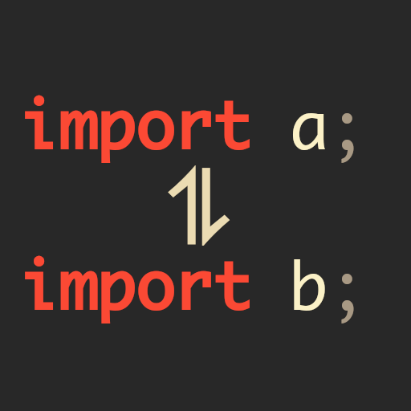

# Sort Imports for [D](https://dlang.org/)

 

`sortimport-d` can sort your dozens of `import`'s in a `.d` file (no matter where)

## Installation

### Prerequirements

- [`dub`](https://dub.pm/)
- [`dmd`](https://dlang.org/)

### Building

Get the repository with `git` and compile everything with `dub`
```
$ git clone https://github.com/friedelschoen/importsort-d
$ cd importsort-d
$ dub build
```

If everything went fine, there should be a binary at `bin/importsort-d`.

Copy this into a directory included in `$PATH` (`/usr/bin` for example) to make this command working global.

## Usage

```
$ importsort-d [--inline [--keep]] [--out <output>] [--original] [--special] [<input>]
```

> `input` may be omitted or set to `-` to read from STDIN

| option                | description                                    |
| --------------------- | ---------------------------------------------- |
| `-i, --inline`        | changes the input                              |
| `-k, --keep`          | keeps the line as-is instead of formatting     |
| `-o, --output <path>` | writes to `path` rather then writing to STDOUT |
| `-r, --original`      | sorts by original rather then the binding      |
| `-s, --special`       | public and static imports first                |


## License

This whole project is licensed under the beautiful terms of the `zlib-license`.

Further information [here](/LICENSE)

> made with love and a lot of cat memes